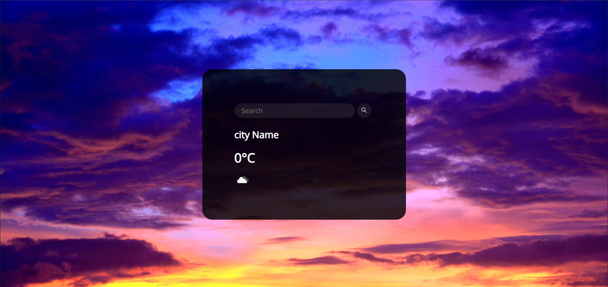

  

# ⛅ Weather App

A simple **Weather Application** built with HTML, CSS, and JavaScript that uses an **API** to fetch real-time weather data.

🔎 Enter the name of any city in the world, press **Enter**, and the app will show you:

* 🌡️ Temperature
* 🌧️ Weather condition (Rainy, Cloudy, Sunny, etc.)
* 
## 🚀 Live Demo

🔗 [View Project Online](https://benyamin012.github.io/Weather-App/)
## 🚀 Features

* Search weather by city name
* Real-time weather data using API
* Simple, clean UI

## 🛠️ Tech Stack

* **HTML5**
* **CSS3**
* **JavaScript (Fetch API)**
## 📸 Screenshot

## 📌 Future Improvements

* Make it fully responsive for mobile

---

✨ Built with ❤️ by Benyamin
